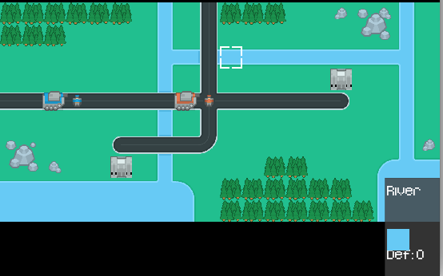
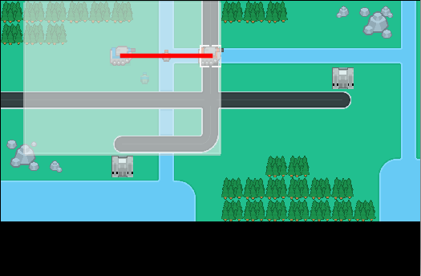

# MP2 - IC Wars

       
       

## LAUNCH: Run Play.java

   

The game is a succession of turns. You will start by taking the following actions:

    
## 1. MOVING THE CURSOR
use directional arrows to move your cursor 

## 2. SELECTING A UNIT
move your cursor over your desired unit and hit ENTER. 
Note: your possible area of displaced (range of a unit) is the faded area.

## 3. MOVING A UNIT
navigate to the desired cell using the arrow keys and then hit ENTER again. 
Note: you cannot move into a cell that is already occupied by a unit.

You can repeat this process for all of your own remaining units.
Once you are done, hit TAB to let your opponent start his turn.

## RESET YOUR GAME: hit R

## MOVE TO NEXT LEVEL: hit N
